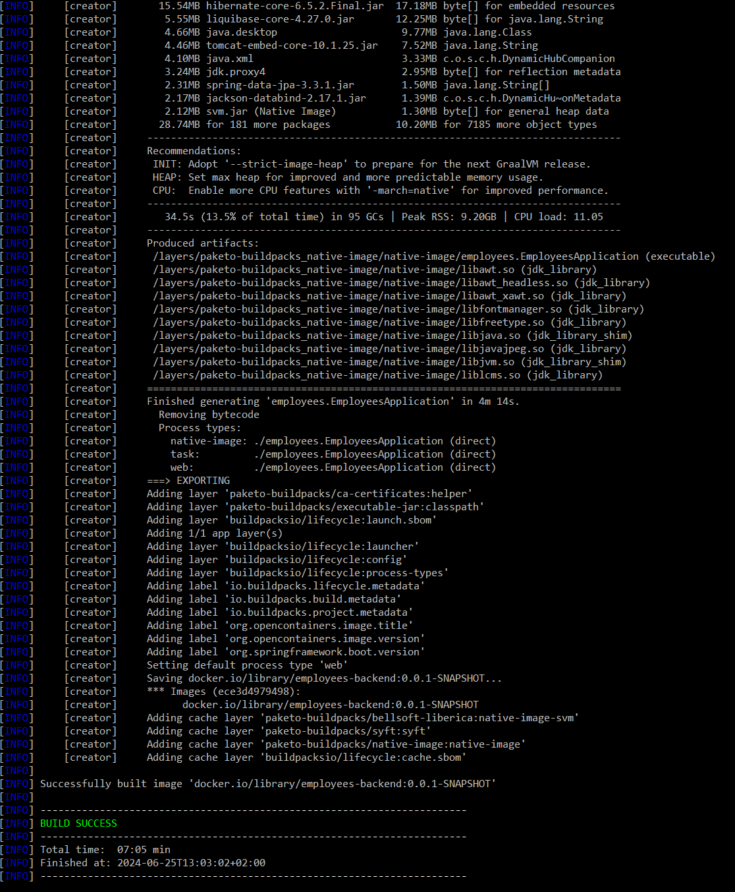
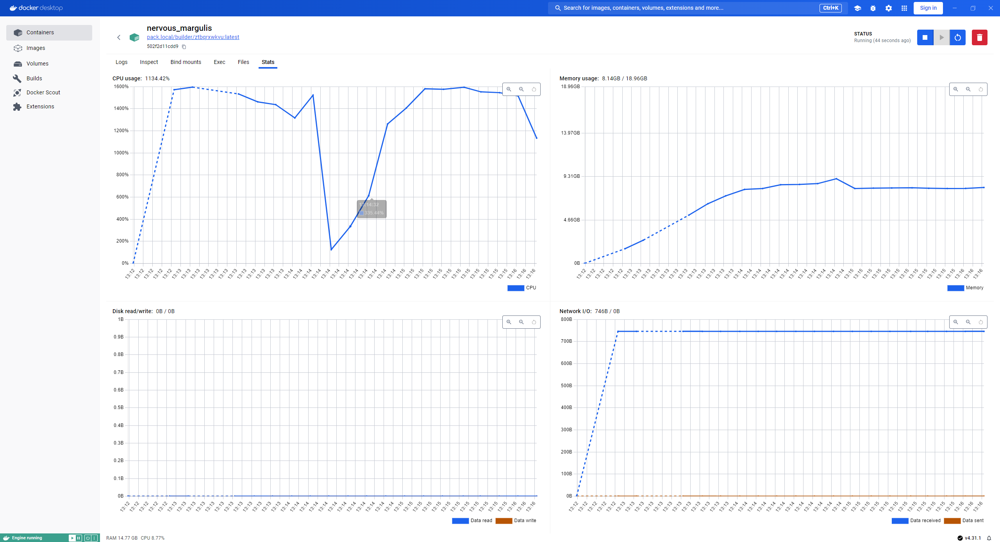

# Actuator

```shell
docker run -d -e POSTGRES_DB=employees -e POSTGRES_USER=employees  -e POSTGRES_PASSWORD=employees  -p 5432:5432  --name employees postgres
```

## Bevezetés

```xml
<dependency>
  <groupId>org.springframework.boot</groupId>
  <artifactId>spring-boot-starter-actuator</artifactId>
</dependency>
```

* Logban:

```plaintext
o.s.b.a.e.web.EndpointLinksResolver:
  Exposing 2 endpoint(s) beneath base path '/actuator'
```


```http
###
GET http://localhost:8080/actuator
```

```properties
management.endpoints.web.exposure.include = *
```

```http
###
GET http://localhost:8080/actuator
```

Dokumentáció: https://docs.spring.io/spring-boot/api/rest/actuator/index.html

* Spring Security-vel ajánlott levédeni
* CORS konfigurálható, ha JavaScript hívja böngészőből


## Health

```http
###
GET http://localhost:8080/actuator/health
```

```properties
management.endpoint.health.show-details = always
```

* Alapból: https://docs.spring.io/spring-boot/reference/actuator/endpoints.html#actuator.endpoints.health.auto-configured-health-indicators
* Saját is implementálható: `HealthContributor`

## Információk megjelenítése - gyakorlat

### Saját értékek

```properties
# Spring Boot 2.6 óta
management.info.env.enabled=true

info.appname = employees
info.contact = employees@example.com
```

### Build és Git

```http
###
GET http://localhost:8080/actuator/info
```

```xml
<build>
  <plugins>
    <plugin>
      <groupId>org.springframework.boot</groupId>
      <artifactId>spring-boot-maven-plugin</artifactId>
      <executions>
        <execution>
          <goals>
            <goal>build-info</goal>
          </goals>
        </execution>
      </executions>
    </plugin>
    <plugin>
      <groupId>io.github.git-commit-id</groupId>
      <artifactId>git-commit-id-maven-plugin</artifactId>
    </plugin>
  </plugins>
</build>
```

```properties
management.info.git.mode=full
```

### Java, OS, Process

```properties
management.info.java.enabled=true
management.info.os.enabled=true
management.info.process.enabled=true
```

* Saját is fejleszthető: `InfoContributor`

## Software Bill of Materials (SBOM)

```xml
<plugin>
    <groupId>org.cyclonedx</groupId>
    <artifactId>cyclonedx-maven-plugin</artifactId>
</plugin>
```

```http
###
GET http://localhost:8080/actuator/sbom
```

```http
###
GET http://localhost:8080/actuator/sbom/application
```

## Naplózás - gyakorlat

```properties
logging.file.name=employees.log
```

```http
###
GET http://localhost:8080/actuator/loggers

###
GET http://localhost:8080/actuator/loggers/employees

###
POST http://localhost:8080/actuator/loggers/employees
Content-Type: application/json

{
"configuredLevel": "info"
}

###
GET http://localhost:8080/actuator/logfile
```


## Shutdown

```properties
management.endpoint.shutdown.enabled = true
```

```http
###
POST http://localhost:8080/actuator/shutdown
```

## Metrics Prometheus Monitoring eszközzel - gyakorlat

https://docs.spring.io/spring-boot/reference/actuator/metrics.html#actuator.metrics.supported

```http
###
GET http://localhost:8080/actuator/metrics
```

Micrometer library

Háttérben `Meter` interfész, létrehozása `MeterRegistry`-vel

Leszármazottjai:

* `Timer`, `Counter`, `Gauge`, `DistributionSummary`, `LongTaskTimer`, `FunctionCounter`, `FunctionTimer` és `TimeGauge`
* Azonosító a név, és tovább bontható tag-ek alapján
* Common tag: operational, pl. környezetek, AWS régiók alapján elválasztásra

* Counter: számláló, legyen inkább `Timer` vagy `DistributionSummary`
* Gauge: aktuális érték (pl. size)
* Timer: egyszerre a lefutás hossza, és milyen gyakran történik
    * Pl.: kérések kiszolgálása
* DistributionSummary: egy esemény eloszlása, mint a timer, de nem lefutás hosszát méri, hanem egy értéket
    * Pl.: beérkező kérések mérete
* LongTaskTimer: akkor is ad információt, amikor még nem futott le pl. az ütemezett feladat

https://docs.spring.io/spring-boot/reference/actuator/metrics.html#actuator.metrics.export

```xml
<dependency>
  <groupId>io.micrometer</groupId>
  <artifactId>micrometer-registry-prometheus</artifactId>
</dependency>
```

* yml konfiguráció, `prometheus.yml`

```yaml
scrape_configs:
  - job_name: employees
    metrics_path: '/actuator/prometheus'
    scrape_interval: 20s
    static_configs:
      - targets: ['host.docker.internal:8080']
```

Prometheus indítása

```shell
cd prometheus
docker compose up -d
```

```http
###
GET http://localhost:8080/actuator/prometheus
```

Prometheus: `http://localhost:9090`

Grafana: `http://localhost:3000/`, `admin`/`admin`

Connections / Data sources / Add data source
Prometheus server url: `http://prometheus:9090` (hisz Docker Compose-on belül)
New dashboard, Add visualization, Prometheus

## Custom metrics - gyakorlat

```java
Counter.builder(EMPLOYEES_CREATED_COUNTER_NAME)
        .baseUnit("employees")
        .description("Number of created employees")
        .register(meterRegistry);

meterRegistry.counter(EMPLOYEES_CREATED_COUNTER_NAME).increment();
```

* `@Timed`, `@Counted` annotációk
* `@MeterTag` annotáció

```java
@Bean
public TimedAspect timedAspect(MeterRegistry registry) {
    return new TimedAspect(registry);
}
```

```java
@Timed(value="employee.create")
public EmployeeResource createEmployee(EmployeeResource command) {
    // ...
}
```

```http
###
GET http://localhost:8080/actuator/metrics/employees.created
```

## Tracing

```xml
<dependency>
    <groupId>io.micrometer</groupId>
    <artifactId>micrometer-tracing-bridge-brave</artifactId>
</dependency>
<dependency>
    <groupId>io.zipkin.reporter2</groupId>
    <artifactId>zipkin-reporter-brave</artifactId>
</dependency>

<dependency>
    <groupId>net.ttddyy.observation</groupId>
    <artifactId>datasource-micrometer-spring-boot</artifactId>
    <version>1.0.3</version>
</dependency>
```

```properties
management.tracing.sampling.probability=1.0
```

```shell
docker run -d -p 9411:9411 --name zipkin openzipkin/zipkin
```

Zipkin: http://localhost:9411

## Observability

Micrometer Observation

* Összefügg: metrics, trace és log

https://spring.io/blog/2022/10/12/observability-with-spring-boot-3

* Grafana, Loki, Tempo

```java
@Component
public class MyCustomObservation {

	private final ObservationRegistry observationRegistry;

	public MyCustomObservation(ObservationRegistry observationRegistry) {
		this.observationRegistry = observationRegistry;
	}

	public void doSomething() {
		Observation.createNotStarted("doSomething", this.observationRegistry)
			.lowCardinalityKeyValue("locale", "en-US")
			.highCardinalityKeyValue("userId", "42")
			.observe(() -> {
				// Execute business logic here
			});
	}

}
```

* Low cardinality: kevés lehetséges érték
* High cardinality: sok lehetséges érték

Annotációval: `io.micrometer.observation.annotation.Observed`

```java
@Observed(name = "list.employees", contextualName = "list.employees", lowCardinalityKeyValues = {"framework", "spring"})
```

* Annotáció használatához kell az AOP is (ezt a Spring Data JPA tranzitív hivatkozza)

* Megjelenik a metrics-nél is
* Megjelenik egy új span
* Megjelenik a logban a traceId

Ha csak trace-t szeretnénk, akkor a Micrometer alacsony szintű `Tracer` APIáját használjuk

```http
###
GET http://localhost:8080/actuator/metrics
```

```http
###
GET http://localhost:8080/actuator/metrics/list.employees
```

https://github.com/jdbc-observations/datasource-micrometer

* `pom.xml`: `spring-boot-starter-aop`, `net.ttddyy.observation:datasource-micrometer-spring-boot`

## Naplózás

```shell
cd efk
docker compose up -d
```

```xml
<dependency>
  <groupId>com.sndyuk</groupId>
  <artifactId>logback-more-appenders</artifactId>
  <version>1.8.8</version>
</dependency>

<dependency>
  <groupId>org.fluentd</groupId>
  <artifactId>fluent-logger</artifactId>
  <version>0.3.4</version>
</dependency>
```

`logback-sample.xml` átnevezése `logback.xml` névre

Kibana: `http://localhost:5601`

Discover / Create data view


## Audit Events - gyakorlat

```java
@Bean
public AuditEventRepository auditEventRepository() {
  return new InMemoryAuditEventRepository();
}
```

```java
applicationEventPublisher.publishEvent(
  new AuditApplicationEvent("anonymous",
    "employee_has_been_created",
      Map.of("name", command.getName())));
```

```http
###
GET http://localhost:8080/actuator/auditevents
```

## Actuator - HttpExchange - gyakorlat

```java
@Bean
public HttpExchangeRepository httpExchangeRepository() {
  return new InMemoryHttpExchangeRepository();
}
```

```http
###
GET http://localhost:8080/actuator/httpexchanges
```

## További végpontok

### JVM belső működés

```http
###
GET http://localhost:8080/actuator/heapdump
```

```http
###
GET http://localhost:8080/actuator/threaddump
```

```http
###
GET http://localhost:8080/actuator/threaddump
Accept: text/plain
```

### Spring belső működés

```http
###
GET http://localhost:8080/actuator/beans

###
GET http://localhost:8080/actuator/conditions

###
GET http://localhost:8080/actuator/mappings

###
GET http://localhost:8080/actuator/configprops

###
GET http://localhost:8080/actuator/env

###
GET http://localhost:8080/actuator/env/spring.datasource.url
```

Sanitize

```properties
management.endpoint.env.show-values=ALWAYS
```

### Kapcsolódó szolgáltatások és library-k

```http
###
GET http://localhost:8080/actuator/liquibase
```

## Saját végpont

```java
@Component
@Endpoint(id = "employeesinfo")
@AllArgsConstructor
public class EmployeesEndpoint {

    private EmployeesRepository employeesRepository;

    @ReadOperation
    public EmployeesInfo getEmployees() {
        return new EmployeesInfo(employeesRepository.count());
    }

    record EmployeesInfo(long numberOfEmployees) {

    }
}
```

```http
###
GET http://localhost:8080/actuator/employees-info
```

## Native image

`pom.xml`

```xml
<plugin>
  <groupId>org.graalvm.buildtools</groupId>
  <artifactId>native-maven-plugin</artifactId>
</plugin>
```

```shell
mvnw -Pnative spring-boot:build-image
```





Minden verzióban valami probléma, újrapróbálkozás 5-7 perc.

## Docker Desktop frissítés

https://github.com/spring-projects/spring-boot/issues/41199

```
Failed to execute goal org.springframework.boot:spring-boot-maven-plugin:3.2.5:build-image (default-cli) on project siva-webapp: Execution default-cli of goal org.springframework.boot:spring-boot-maven-plugin:3.2.5:build-image failed: Illegal char <:> at index 5: npipe:////./pipe/dockerDesktopLinuxEngine
```

A 4.31.1 Docker Desktop (Windows 11) nem működik együtt a Spring Boot 3.3.1-gyel, Java 21.

Megoldás:

```xml
<plugin>
  <groupId>org.springframework.boot</groupId>
  <artifactId>spring-boot-maven-plugin</artifactId>
  <configuration>
    <docker>
      <host>//./pipe/dockerDesktopLinuxEngine</host>
    </docker>
  </configuration>
  <!-- ... -->
</plugin>
```

## Liquibase

```plaintext
Caused by: java.lang.NoSuchMethodException: liquibase.database.LiquibaseTableNamesFactory.<init>()
2024-06-25 13:26:00 employees-app-1  |  at java.base@21.0.3/java.lang.Class.checkMethod(DynamicHub.java:1078)
2024-06-25 13:26:00 employees-app-1  |  at java.base@21.0.3/java.lang.Class.getConstructor0(DynamicHub.java:1241)
2024-06-25 13:26:00 employees-app-1  |  at java.base@21.0.3/java.lang.Class.getDeclaredConstructor(DynamicHub.java:2930)
```

https://github.com/oracle/graalvm-reachability-metadata/issues/431

Liquibase 4.27 még nincs felkészítve a GraalVM-re.

`LoggerUIService.class`, stb.

Megoldás:

```java
@SpringBootApplication
@ImportRuntimeHints(EmployeesApplication.EmployeesApplicationRuntimeHints.class)
public class EmployeesApplication {

  // ...

	static class EmployeesApplicationRuntimeHints implements RuntimeHintsRegistrar {
		@Override
		public void registerHints(RuntimeHints hints, ClassLoader classLoader) {
			hints.reflection()
					.registerType(LoggerUIService.class, type ->
						type.withConstructor(Collections.emptyList(), ExecutableMode.INVOKE))
					.registerType(LiquibaseTableNamesFactory.class, type ->
							type.withConstructor(Collections.emptyList(), ExecutableMode.INVOKE));
		}
	}
}
```

https://github.com/liquibase/liquibase/issues/1552